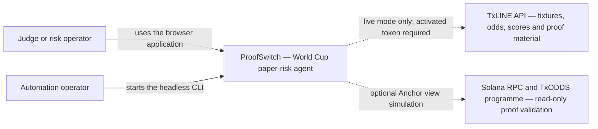
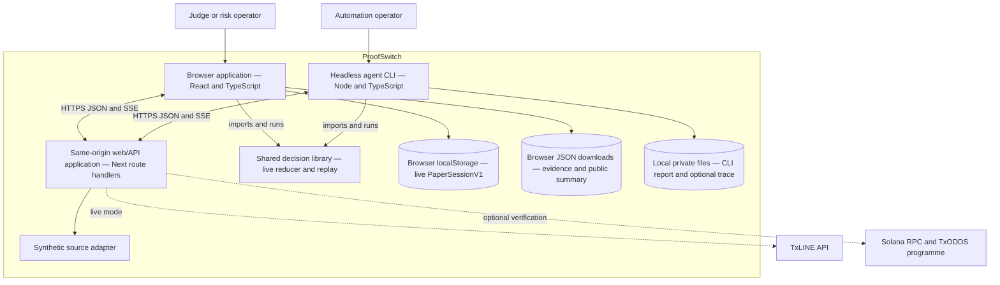
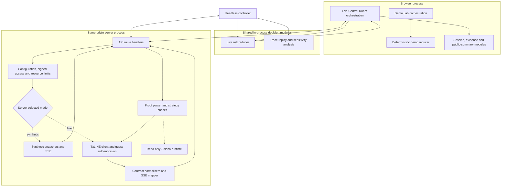
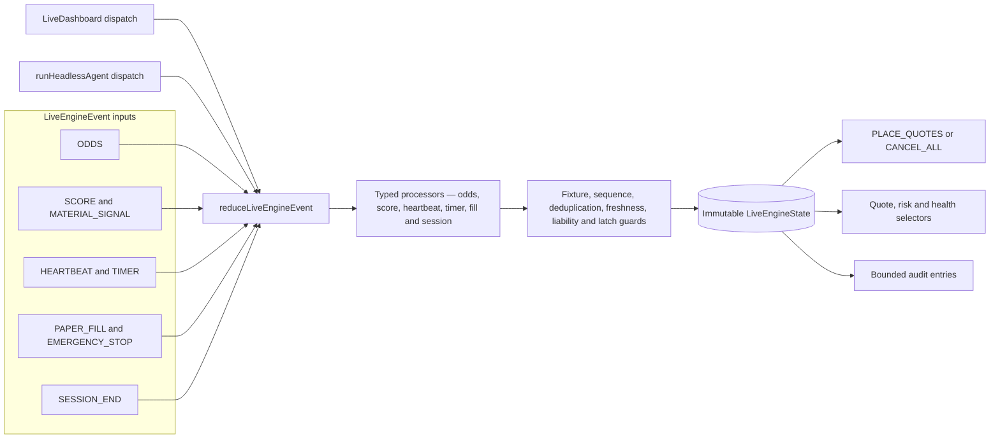
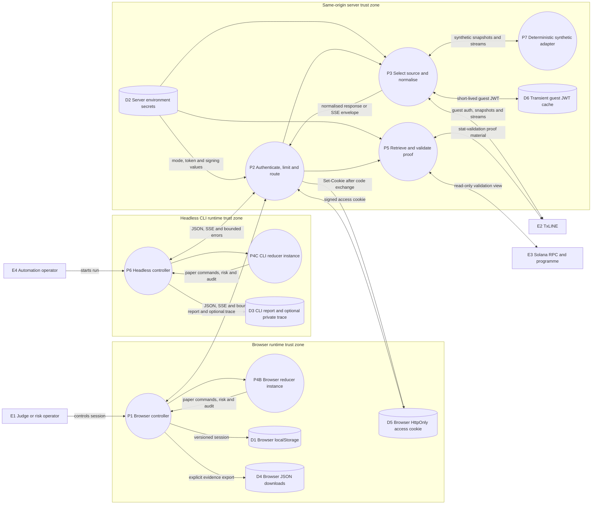
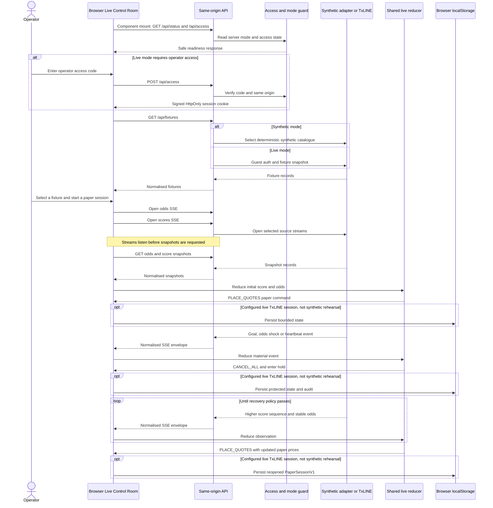
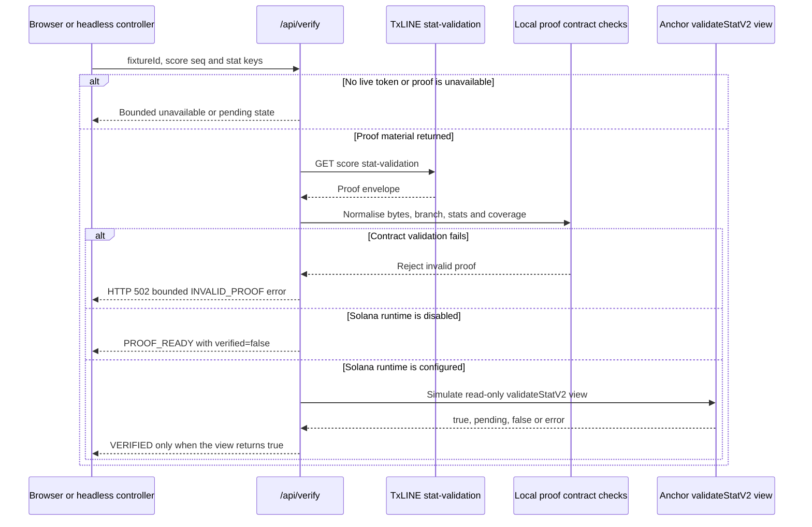
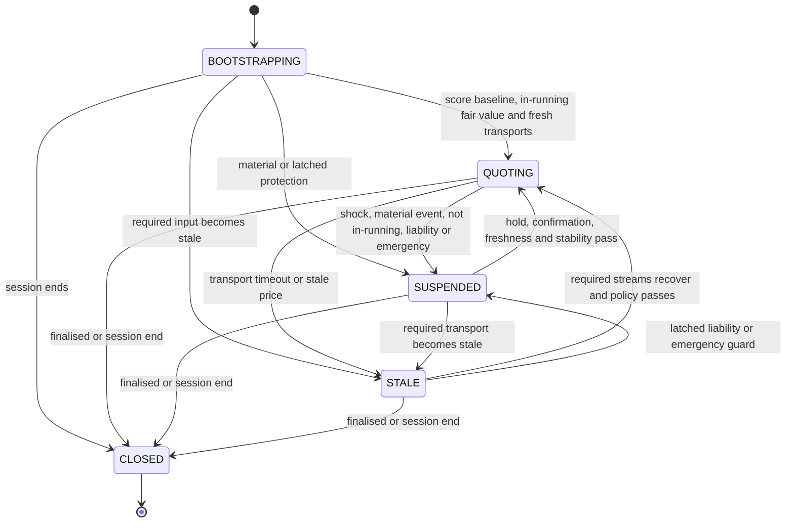
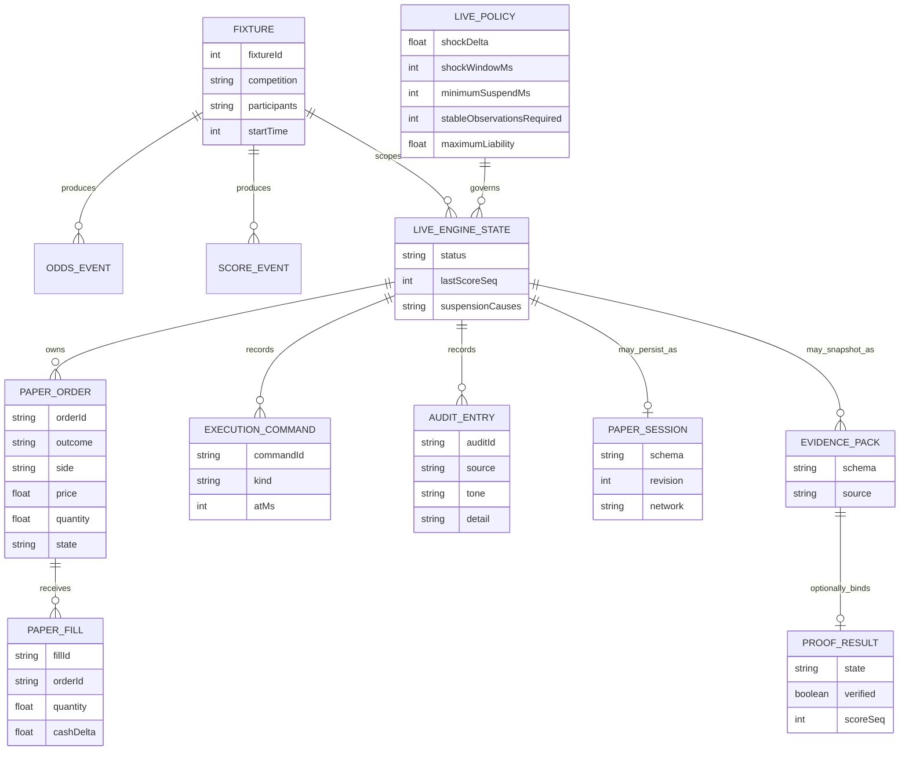
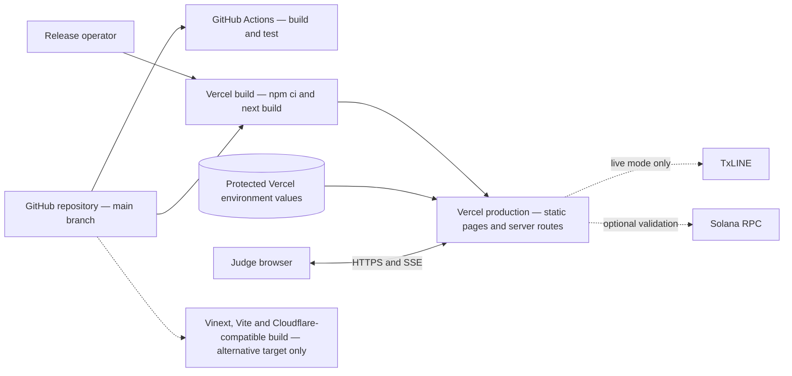

# System Architecture: ProofSwitch

## Overview

ProofSwitch is a full-stack web application and browser-independent Node CLI for autonomous, paper-only World Cup market-risk control. A same-origin server gateway protects and normalises either synthetic or TxLINE inputs. The browser and headless CLI each run the shared deterministic live reducer in their own process, then retain only local paper state and evidence.

The public deployment is deliberately split into two modes:

- **Synthetic mode** is credential-free and powers the public judge walkthrough.
- **Live mode** requires an activated TxLINE token and operator-access secrets. It fails closed when those values are missing and never substitutes synthetic data for a failed live request.

ProofSwitch has no real-order or exchange connection, no application database and no wallet private key. The optional Solana path is a read-only Anchor view simulation. A proof is labelled verified only when that view returns a matching successful result.

| Architecture fact | Current implementation |
| --- | --- |
| System type | React/Next full-stack web application plus a Node headless CLI |
| Primary track | Trading Tools and Agents |
| Decision runtime | Browser process or headless CLI process |
| Server role | Same-origin access control, source selection, normalisation, SSE relay and proof boundary |
| Persistence | Browser localStorage, browser JSON downloads, a mandatory local CLI report and an optional private CLI trace |
| External systems | TxLINE and an optional Solana RPC/TxODDS programme |
| Execution | Deterministic paper orders and fills only |
| Public state on 19 July 2026 | Synthetic mode; live TxLINE and Solana verification are not claimed |

## Key Requirements

- Ingest fixture, match-winner odds, score and heartbeat data through one bounded internal contract.
- Detect odds shocks, material match events, transport timeouts, stale prices and liability breaches.
- Cancel unsafe paper quotes automatically and reopen only after explicit recovery conditions pass.
- Keep strategy decisions deterministic, replayable and independent from the UI.
- In the browser path, open both SSE channels before loading snapshots so updates cannot fall into a snapshot-to-subscription gap; retain sequence/timestamp guards in both browser and CLI paths.
- Keep TxLINE tokens, guest JWTs and access-signing secrets on the server.
- Make the server environment, not browser query parameters, authoritative for synthetic versus live mode.
- Keep all market execution paper-only and keep the Solana path read-only.
- Retain bounded local audit/evidence records without publishing licensed TxLINE-derived data by default.
- Fail closed on missing configuration, authentication failure, malformed payloads, stale transport or proof ambiguity. Prevent a live session from opening if its initial evidence write fails, and visibly lock later persistence after a subsequent storage failure.
- Support a guided browser demo, a production-path rehearsal and a manually started headless agent.

Current eligibility gap: the sponsor brief requires TxLINE as a live input. The code path is implemented and contract-tested, but no credential-backed live session is claimed without an activated token.

## High-Level Architecture

The following views use the four C4 abstraction levels. Standard Mermaid flowcharts are used instead of Mermaid's experimental C4 syntax so the diagrams render reliably on GitHub.

### C1: System context

ProofSwitch is the system of interest. TxLINE and Solana are external dependencies reached only through guarded server paths. There is intentionally no execution venue, consumer wallet or real-money order flow.

### C2: Containers

The live reducer is a shared library loaded separately by the browser and CLI; it is not a central server process. The server owns no paper ledger or application database. The browser persists a bounded live session in localStorage and creates evidence as an explicit local download. Every CLI run writes a local report, using either the requested path or an automatically generated path; the private canonical trace is optional.

### C3: Components

The Demo Lab uses its own deterministic scenario reducer. The production-path rehearsal, Live Control Room and headless runner use the shared live reducer. Route handlers never make trading decisions; they return bounded, normalised data or errors.

### C4: Code-level reducer view

The code-level control point is [reduceLiveEngineEvent](./app/live-engine.ts), called independently by [LiveDashboard](./app/live-dashboard.tsx) and [runHeadlessAgent](./server/headless-agent.ts). It applies typed processors and latched safety guards to produce a new immutable LiveEngineState. UI tables, paper commands, risk metrics and audit entries are derived from that state; callers cannot provide a forged fill price because fills reference the engine's working paper order.

## Component Details

| Component | Responsibilities and technology | Data owned or transformed | External dependencies | Main failure modes |
| --- | --- | --- | --- | --- |
| [Demo Lab](./app/page.tsx) and [scenario reducer](./app/simulation.ts) | Runs guided goal-shock, outlier and stale-feed demonstrations in React/TypeScript. | Scenario events, consensus frames, demo quotes and decision receipts. | None. | Invalid scenario input, browser interruption or stale device preference. |
| [Live Control Room](./app/live-dashboard.tsx) | Opens snapshots and SSE, dispatches events, renders paper risk and builds evidence. | Connection state, selected fixture, live reducer state and export previews. | Same-origin API, EventSource, localStorage and Web Crypto. | Stream contract error, snapshot failure, local-storage failure or unavailable checksum API. |
| [Headless agent](./server/headless-agent.ts) | Runs the same production-path strategy without a browser and produces bounded reports/replays. | In-memory live state, metrics and an owner-only local report on every CLI run; a private canonical trace is written only when requested. | Same-origin HTTP/SSE API and local filesystem through the CLI wrapper. | Request timeout, stream failure, trace limit, missing access code or invalid output path. |
| [API routes](./app/api) | Expose status, access, fixtures, odds, scores, SSE, proof and submission metadata. | Safe JSON/SSE envelopes and bounded errors. | Server environment, TxLINE and optional Solana runtime. | Missing configuration, unauthorised access, upstream failure or per-isolate resource limit. |
| [Access and configuration](./server/access-control.ts) | Validates mode/network configuration, exchanges an operator code for an HMAC-signed cookie and applies rate/concurrency leases. | Expiring HttpOnly session cookie and in-memory per-isolate counters. | Web Crypto and server environment values. | Partial secret configuration, invalid origin, bad code, expired/tampered cookie or exhausted limit. |
| [Source adapters](./server/txline.ts), [normalisers](./server/normalise.ts) and [SSE mapper](./server/sse.ts) | Authenticate, fetch, stream, parse and convert provider data into internal contracts. | Fixture IDs, StablePrice probabilities, score sequences, heartbeats and contract errors. | TxLINE in live mode. | 401 refresh failure, 403 network/subscription mismatch, unreachable provider, invalid JSON or schema mismatch. |
| [Live decision library](./app/live-engine.ts) | Detects shocks and material events; cancels, holds, requotes, fills and settles paper positions. | LiveEngineState, paper orders/fills, commands, audit and risk ledger. | None; it is a pure TypeScript state machine. | Malformed/out-of-order events are rejected; liability and emergency stops latch protection; closed state is terminal. |
| [Session and evidence modules](./app/live-session.ts) and [live evidence](./app/live-evidence.ts) | Persist a versioned browser session and build bounded canonical evidence or a safe public synthetic summary. | Device-local session, checksums, proof binding and aggregate public summary. | localStorage and Web Crypto. | Quota/unavailable storage, stale revision, unsupported version, oversized record or source mismatch. |
| [Proof boundary](./server/verification.ts) and [Solana runtime](./server/solana-runtime.ts) | Validate proof shape and strategy coverage, then optionally simulate validateStatV2 through Anchor. | Normalised proof nodes, stat predicates, daily-root seed and bounded verification state. | TxLINE proof endpoint, Solana RPC and published programme. | Proof/root pending, invalid proof, false predicate, missing simulation payer, RPC failure or runtime disabled. |

There is no order or trading API. PLACE_QUOTES, CANCEL_ALL, paper orders and paper fills are records inside each reducer instance. The synthetic production-path rehearsal is also deliberately excluded from the retained live PaperSessionV1 record.

## Data Flow

### Data-flow diagram (DFD level 1)

Persistent credentials are split across two boundaries: server environment storage holds the TxLINE token and access-signing values, while the browser cookie jar holds the signed, expiring operator session. A TxLINE guest JWT exists only in a short-lived per-client server-memory cache. Normalised data crosses into the browser or CLI; TxLINE tokens and guest JWTs do not. Browser evidence remains device-local, and the mandatory CLI report plus any optional trace remain private unless explicitly published. No paper command leaves ProofSwitch for an exchange.

### Autonomous session sequence

Readiness, access state and fixtures load before the operator starts a session. Once started, market decisions are automatic. Recovery requires fresh required transports, any required score confirmation, the minimum hold and the configured number of stable observations. Human clicks select or stop a run; they do not approve each trading decision. The browser opens both streams before requesting snapshots. The headless CLI uses a distinct bounded bootstrap: it loads snapshots first and then opens the streams.

### Proof validation sequence

This path sends no Solana transaction and requests no wallet signature. Proof retrieval, proof readiness and on-chain verification are deliberately separate states. The proof response metadata repeats the requested score sequence; the returned Merkle body does not independently attest that sequence, so local evidence also binds the response metadata to the active decision.

### Quote-protection state machine

CLOSED is terminal and cancellation is idempotent. SUSPENDED and STALE cannot reopen from time alone; every configured recovery predicate must pass. Maximum-liability and emergency-stop guards latch for the session, so their SUSPENDED state cannot recover into QUOTING.

## Data Model

The model is logical rather than relational: no production database is active. LiveEngineState owns the current paper ledger, while PaperSessionV1 and evidence packs are bounded serialisations of selected state.

### Logical data model

Key contracts are Fixture, MatchWinnerOdds, ScoreSnapshot, LivePolicy, LiveEngineState, LivePaperOrder, LivePaperFill, LiveExecutionCommand, LiveAuditEntry, PaperSessionV1, proofswitch.live-evidence.v1 and proofswitch.public-demo-summary.v1. In the diagram, `suspensionCauses` represents an array. Current liability is a selector-derived paper-risk value, not a stored LiveEngineState field. A PaperSessionV1 is optional and exists only for a retained browser live session; headless and synthetic-rehearsal reducer states have no PaperSessionV1. Evidence export is also optional and may be generated more than once from a state. Its SHA-256 checksum belongs to the serialisation/download metadata, not the LiveEvidencePack object itself.

## Infrastructure and Deployment

### Current production deployment

The current public target is Vercel at <https://proofswitch.vercel.app>. Vercel runs npm ci followed by next build. The repository also builds Cloudflare Worker-compatible output through Vinext/Vite, but that is an alternative build path, not evidence of a Cloudflare production deployment. D1 and R2 are both null in the current hosting configuration.

Runtime configuration is supplied through environment values:

| Category | Values | Exposure |
| --- | --- | --- |
| Source selection | PROOFSWITCH_MODE, TXLINE_NETWORK, TXLINE_API_ORIGIN | Server authoritative; safe status fields may be public |
| TxLINE access | TXLINE_API_TOKEN and short-lived guest JWT | Server secret; never returned to clients |
| Operator access | PROOFSWITCH_ACCESS_CODE, PROOFSWITCH_ACCESS_SIGNING_SECRET and TTL/limit settings | Server secret; code is exchanged for an HttpOnly cookie |
| Strategy policy | shock, freshness, hold, stability, requote and liability settings | Server configuration; bounded values are reported in status |
| Solana boundary | SOLANA_RPC_URL, TXLINE_PROGRAM_ID, SOLANA_VALIDATION_ENABLED and public simulation payer | No private key; runtime remains disabled until explicitly configured |

## Scalability and Reliability

| Mechanism | Implemented behaviour | Limitation or next step |
| --- | --- | --- |
| Fail-closed live mode | Missing tokens or access settings return bounded errors without synthetic fallback. | Complete a credential-backed run and operational rehearsal. |
| Snapshot/SSE ordering | The browser opens both streams before snapshots; the CLI uses snapshots first. Both paths apply sequence and timestamp guards. | Validate both bootstrap/reconnect behaviours against genuine provider traffic. |
| Stream health | Heartbeats, source age and transport age are measured independently. | Add provider latency metrics and shared monitoring. |
| Resource limits | Request rate, concurrent requests, concurrent streams and stream duration are bounded per isolate. | Replace with distributed/global controls for multi-instance production. |
| Deterministic state | Reducers, replays and policy sensitivity are covered by automated tests. | Add long-running soak and property-based tests. |
| Evidence bounds | Session, trace, audit and export sizes are capped and versioned. | Add encrypted durable storage only if multi-device retention is required. |
| Provider failure | Invalid JSON/schema becomes a contract error and the agent closes or protects the paper market. | Add explicit server-side provider timeouts, shared stream fan-out, back-pressure telemetry and a failover policy. |

The headless agent is a manually started CLI, not a continuously scheduled service. There is no shared stream multiplexer, global rate limiter, failover region or production-grade Solana RPC plan.

## Security and Compliance

- **Secrets management:** TxLINE and access secrets are read from server environment values. Status responses expose presence/readiness, not secret values.
- **Trust boundary:** server configuration chooses the upstream origin, network and mode. A browser query cannot redirect the server or force live/synthetic switching.
- **Authentication:** live sponsor-data routes can require a shared operator code. Successful same-origin exchange issues an HMAC-signed, expiring, HttpOnly, SameSite=Strict cookie. There are no user accounts, roles or recovery flow.
- **Authorisation limits:** access and rate counters are in-memory per runtime isolate and are not a distributed abuse-prevention service.
- **Sensitive data:** browser evidence and CLI traces may contain TxLINE-derived prices or scores. They are local and unencrypted; users must not publish them without sponsor permission.
- **Session recovery:** a recovered browser session is protected and remains disconnected; transports are never resumed silently after recovery, network mismatch or storage conflict.
- **Public data boundary:** only a synthetic aggregate summary is intended for public export. The code blocks a TxLINE-derived public download by default.
- **Wallet boundary:** only a public simulation-payer address is accepted. No seed phrase, private key, wallet file, transaction signing or on-chain write belongs in the app.
- **Provider risk:** TxLINE, Vercel and Solana RPC availability remain external risks. Failures are converted into bounded states rather than success.
- **Auditability:** commands, paper fills, risk values, audit entries and canonical checksums aid review. Checksums are not signatures and local evidence is not tamper-proof attestation.
- **Product boundary:** ProofSwitch is paper-only and does not offer consumer wagering, custody, settlement or financial execution. Any real execution adapter would require separate legal, compliance and operational review.

Controls not currently present include encrypted evidence at rest, central identity/RBAC, distributed rate limiting, a WAF-specific policy, central security logging, independent penetration testing and formal threat-model sign-off.

## Observability

| Signal | Current surface | Missing production capability |
| --- | --- | --- |
| Runtime readiness | /api/status and the Live Control Room preflight | External uptime and configuration-drift alerts |
| Transport health | Odds/score connection state, heartbeat age and contract errors | Central provider-latency and reconnect dashboards |
| Strategy behaviour | Decision timeline, commands, paper fills, P&L and policy sensitivity | Cross-session aggregation and anomaly alerts |
| Evidence | Canonical local export, checksum and headless report | Signed central retention and controlled reviewer access |
| Server behaviour | Safe API errors and deployment logs | Correlation IDs, structured application logs and distributed tracing |

No central observability backend is configured. A production service should add request/session correlation IDs without logging tokens, guest JWTs, access codes or licensed raw payloads.

## Design Decisions and Trade-offs

| Decision | Why | Trade-off |
| --- | --- | --- |
| Client/CLI-hosted reducer | Makes decisions deterministic, inspectable and reusable across browser and headless runs. | Each runtime owns separate state; there is no central continuous agent. |
| Server-only data gateway | Protects credentials and enforces one source/mode boundary. | Serverless SSE durability and provider behaviour still need live validation. |
| Synthetic public mode | Gives judges a working deterministic application without sponsor credentials. | It does not satisfy the sponsor's live-input requirement by itself. |
| Paper execution only | Demonstrates controls without real-money, custody or venue risk. | No exchange integration, market settlement or realised production performance is proven. |
| Device-local evidence | Keeps the prototype simple and avoids a sensitive backend datastore. | Evidence is single-device, unencrypted and not independently attested. |
| Strict normalisation | Quarantines malformed provider data before it reaches strategy logic. | Real payload variants can only be confirmed during a genuine live run. |
| Read-only Solana view | Verifies a proof without storing a wallet secret or sending a transaction. | Requires genuine proof material, a valid public simulation payer and reliable RPC. |
| Standard Mermaid diagrams | Renders the C4 interpretation directly on GitHub. | C4 semantics are expressed with flowcharts rather than a specialised modelling tool. |

## Future Improvements

1. Run and privately record a genuine TxLINE fixture, snapshot and dual-SSE session after an activated sponsor token is available.
2. Validate a genuine score proof against its matching posted root and publish only a redacted verification record permitted by the sponsor.
3. Add request/session correlation IDs, structured logs, provider timing and external uptime monitoring.
4. Add a distributed rate limiter and shared SSE fan-out before supporting uncontrolled concurrent users.
5. Add encrypted, access-controlled durable evidence only if multi-device review becomes a product requirement.
6. Add long-running reconnect, soak, load and property-based strategy tests.
7. Perform a formal threat-model and data-licensing review before any production or real-execution integration.
8. Introduce an execution-venue adapter only after legal, compliance, reconciliation, kill-switch and operational controls are separately designed and approved.
