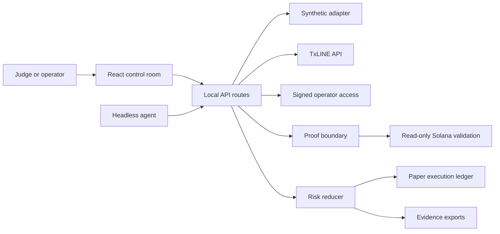
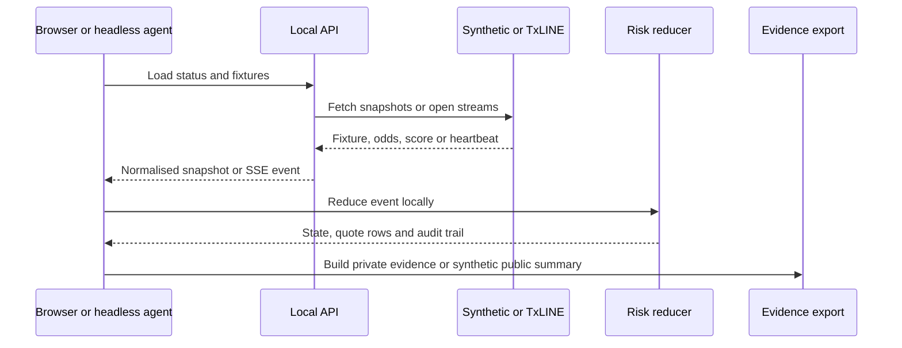

# System Architecture: ProofSwitch

## Overview

ProofSwitch is a local-first, paper-only in-play risk operator for World Cup market-making demos. It combines a React control room, local API routes, TxLINE-compatible adapters, a deterministic risk reducer, paper execution records and unsigned evidence exports.

The system is intentionally split between credential-free synthetic operation and sponsor-backed live operation. Live mode must be configured explicitly and fails closed when TxLINE access, operator access or Solana validation requirements are absent.

## Submission Track Positioning

ProofSwitch should be submitted primarily under **Trading Tools and Agents**. Its main technical claim is an autonomous agent that consumes odds, scores and stream health, detects market-risk signals, runs deterministic strategy policy and produces paper quote decisions.

It has a secondary **Consumer and Fan Experiences** story through the guided judge walkthrough, fixture timeline and public synthetic summary, but that is not the core build. It should not be submitted as **Prediction Markets and Settlement** in the current state because the app does not create markets, resolve them or settle positions on-chain.

## TxLINE Sponsor Criteria Mapping

- Core functionality and data ingestion: fixture, odds, score and stream routes are implemented around TxLINE-shaped contracts; synthetic mode keeps the same normalised reducer path until live access is configured.
- Autonomous operation: Demo Lab replay, Live Control Room judge mode and the headless runner can run the signal-detection and paper-execution loop without manual decisions after launch.
- Logic and code architecture: strategy rules are deterministic, tested and separated from UI, transport adapters and Solana validation.
- Innovation and novelty: the app combines sharp movement detection, in-play market making, stale-feed protection, proof-aware evidence and a public synthetic summary boundary.
- Production readiness: live mode fails closed, secrets stay server-side, operator access is gated, rate/concurrency limits are bounded, and public exports avoid licensed TxLINE-derived data unless sponsor permission is given.

Current gap: the hackathon brief requires TxLINE as a live input for final eligibility. This repository is credential-ready, but a genuine live session still must be run after `TXLINE_API_TOKEN` and matching network settings are configured.

## Key Requirements

- Demonstrate autonomous in-play protection for World Cup match-winner markets.
- Optimise the submission for the Trading Tools and Agents track while preserving a clear London local judging story.
- Cover the TxLINE Trading Tools and Agents judging criteria with explicit data-ingestion, autonomy, strategy, novelty and production-readiness evidence.
- Keep all execution paper-only.
- Keep TxLINE tokens, guest JWTs and Solana runtime settings server-side.
- Avoid public redistribution of TxLINE-derived data without sponsor permission.
- Preserve deterministic audit and evidence records for judging.
- Support local demo, live control room and browser-independent headless operation.
- Never label a proof as Solana verified unless a matching read-only validation result succeeds.

## High-Level Architecture

The browser and headless runner both use the local API surface. The API selects synthetic or live data from server configuration, not browser trust. The reducer owns safety decisions and paper execution state; evidence exports package the current retained state without secrets.

## Component Details

### Browser Application

- Responsibilities: demo lab, live control room, judge mode, preflight, scorecard, fixture timeline, sponsor evidence, evidence preview and download.
- Main technologies: React, TypeScript, CSS modules through the app stylesheet.
- Data owned or transformed: browser UI state, device-local paper-session record, local export contents.
- External dependencies: local API routes only.
- Failure modes: stale local storage, cross-tab conflicts, missing credentials, missing fixture, failed streams, unavailable Web Crypto checksum API.

### Local API Routes

- Responsibilities: status, operator access, fixtures, odds, scores, SSE streams and proof boundary.
- Main technologies: Vinext/Next-style route handlers, TypeScript, Web APIs.
- Data owned or transformed: normalised fixtures, odds, scores, stream envelopes and safe API errors.
- External dependencies: TxLINE API when live mode is configured.
- Failure modes: missing token, locked operator access, upstream authentication failure, schema mismatch, stream contract error, request or stream concurrency limit.

### TxLINE Adapter

- Responsibilities: guest authentication, API-token authenticated requests, snapshot retrieval, stream opening and proof request forwarding.
- Main technologies: `fetch`, `EventSource`-compatible SSE mapping, typed normalisers.
- Data owned or transformed: fixture IDs, StablePrice odds, score sequences and proof response envelopes.
- External dependencies: TxLINE API origin matching the selected network.
- Failure modes: 401 guest token refresh, 403 subscription or network mismatch, invalid JSON, schema mismatch, unreachable endpoint.

### Risk Reducer and Paper Execution

- Responsibilities: event reduction, shock detection, score-event guarding, stale-feed protection, repricing, quote placement, cancellation, fills, liability and P&L.
- Main technologies: pure TypeScript state reducer.
- Data owned or transformed: market status, quote rows, audit entries, paper orders, fills, execution commands and risk ledger.
- External dependencies: none.
- Failure modes: malformed events are quarantined; finalised and emergency-stop states are terminal; maximum-liability breach rejects the candidate fill before execution.

### Evidence and Session Storage

- Responsibilities: versioned local paper session, canonical evidence pack, synthetic public summary and byte-size boundaries.
- Main technologies: browser local storage, Web Crypto SHA-256, canonical JSON serialisation.
- Data owned or transformed: retained paper orders, fills, commands, audit entries, proof result and transport health.
- External dependencies: browser storage and crypto APIs.
- Failure modes: storage unavailable, record too large, revision conflict, network mismatch, unsupported future version.

### Solana Validation Boundary

- Responsibilities: compile score-stat proof predicates and execute the read-only validation path when configured.
- Main technologies: `@solana/web3.js`, Anchor, pinned TxODDS devnet IDL subset.
- Data owned or transformed: proof stats, Merkle branches, epoch-day seed and validation state.
- External dependencies: devnet RPC, published TxODDS programme and posted daily root.
- Failure modes: proof pending, root pending, invalid proof, predicate false, runtime unconfigured, RPC failure.

## Data Flow

Live credentials are not sent to the browser. The browser receives normalised data and uses the deterministic reducer for demo and evidence state. A live proof request remains separate from Solana verification until the runtime returns a true validation result.

## Data Model

- `Fixture`: fixture identity, competition, start time and participants.
- `MatchWinnerOdds`: StablePrice probabilities and source metadata.
- `ScoreSnapshot`: score sequence, cumulative score, red cards and game state.
- `LiveEngineState`: policy, status, score, quote state, orders, fills, commands, audit and risk ledger.
- `PaperSessionV1`: single device-local retained paper-session record.
- `proofswitch.live-evidence.v1`: private canonical evidence pack.
- `proofswitch.public-demo-summary.v1`: synthetic-only aggregate public summary.
- `proofswitch.demo-bundle.v1`: local judging bundle with readiness, scorecard, boundary and timeline metadata.

## Infrastructure and Deployment

The project uses Vinext with Cloudflare Worker-compatible output for the local Sites-compatible path and standard Next.js output for Vercel. `.openai/hosting.json` currently declares no D1 or R2 resources. The public judge deployment is <https://proofswitch.vercel.app>, with the submission pack at `/submission`. Local development runs with `npm run dev`; production validation runs through `npm run build` and the Vercel adapter runs `npx next build`.

## Scalability and Reliability

Current reliability features:

- fail-closed live configuration;
- signed operator access cookie;
- per-isolate request and stream limits;
- explicit stream contract errors;
- heartbeat-aware transport freshness;
- deterministic session closure on disconnect or page unload;
- bounded local evidence records.

Current scalability limits:

- request and stream limits are not globally coordinated;
- no shared stream fan-out exists;
- local storage is single-device only;
- public Solana RPC is not a production traffic plan.

## Security and Compliance

- Secrets management: tokens and signing secrets are read from server environment values and not returned in status payloads.
- Client/server trust boundary: browser query strings do not choose arbitrary upstream hosts; server config controls live origin and mode.
- Authentication and authorisation: live sponsor routes require a signed, expiring HttpOnly same-origin session cookie when configured.
- Sensitive data handling: private evidence may contain TxLINE-derived prices and scores and must remain private.
- Third-party provider risk: TxLINE and Solana RPC failures are surfaced as bounded states, not converted into success.
- Auditability: reducer audit entries, evidence checksums and provenance logs support judging, but they are not signatures.

## Observability

The app exposes UI status, preflight results, evidence previews, audit logs and headless run reports. It does not yet have centralised logs, trace IDs or external monitoring. For a deployed multi-user version, add request IDs, provider timing and structured server logs.

## Design Decisions and Trade-offs

- Local-first demo instead of production trading: enables honest judging without credentials, but live sponsor proof remains pending.
- Paper execution only: avoids real-money and exchange risk while proving risk logic.
- Deterministic reducer: improves testability and replay, but external stream behaviour still requires live validation.
- Device-local evidence: simple and inspectable, but not multi-device or tamper-proof.
- Public synthetic summary only: protects sponsor data rights at the cost of less public live-run detail.
- Read-only Solana validation: avoids wallet private keys in the app, but requires a public funded simulation payer and genuine proof data.

## Future Improvements

- Add a genuine TxLINE run record once sponsor access is issued.
- Add verified Solana proof evidence for a real fixture and sequence.
- Add deployment and public demo video if required by submission rules.
- Add centralised request IDs and structured provider diagnostics.
- Add shared rate limits and stream fan-out for production usage.
- Add explicit sponsor-approved derived-data publication policy.
- Add screenshots and accessibility browser verification before final public submission.
