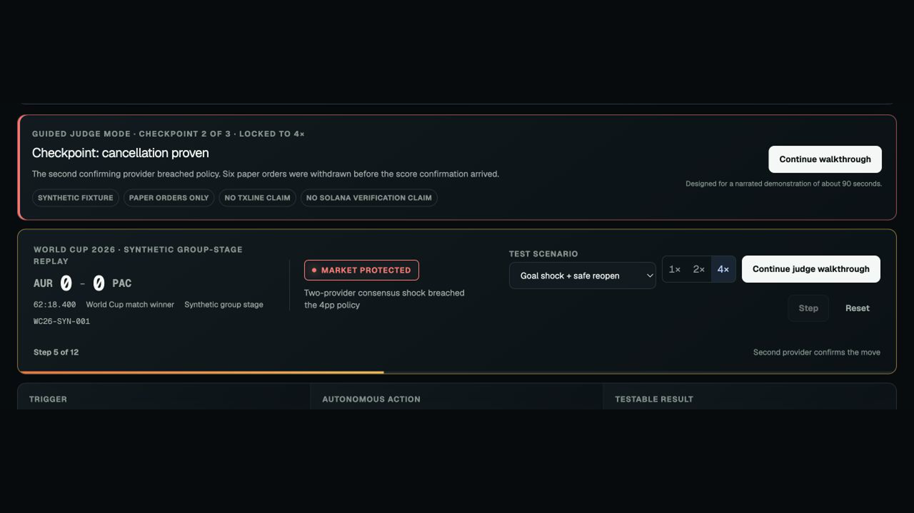
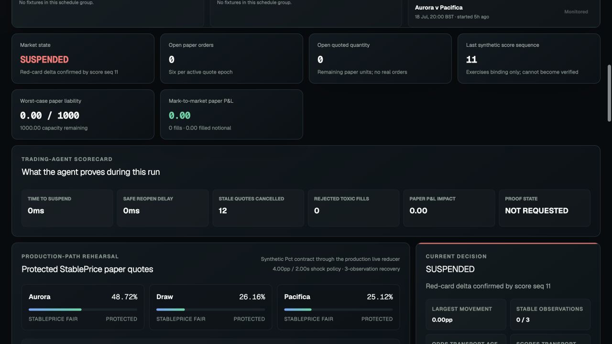
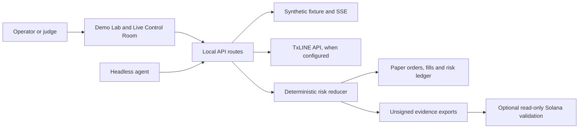

# ProofSwitch

[](https://github.com/MasteraSnackin/proofswitch/actions/workflows/ci.yml)

[Live application](https://proofswitch.vercel.app) · [90-second judge walkthrough](https://proofswitch.vercel.app/?judge=1) · [4:48 demo video](https://youtu.be/0uxTKx0Jf0Q) · [Judge pack](https://proofswitch.vercel.app/submission) · [Submission manifest](https://proofswitch.vercel.app/api/submission)

Local-first World Cup in-play risk operator for the TxOdds x Solana hackathon.

## Description

ProofSwitch is a paper-only trading agent for World Cup in-play markets. It watches StablePrice-shaped prices, score events and stream health, withdraws unsafe paper quotes, waits for deterministic recovery evidence, then reopens only when the configured policy allows it.

The project is built for the global Trading Tools and Agents track and the London local judging context. It is not a consumer betting app, does not place real orders, and does not claim live TxLINE or Solana verification until credentials and genuine proofs are configured.

## Business Highlights

- **User:** sports trading teams, market makers and risk operators.
- **Problem:** goals, odds shocks and stale data can leave unsafe quotes live during the most volatile seconds of a match.
- **Value:** deterministic circuit breaking, guarded reopening and an audit trail for every automated decision.
- **Commercial path:** connect the protected command layer to an execution venue after compliance, risk and reliability review.
- **Current boundary:** paper execution only; no real orders and no consumer betting.

The complete judge-facing wording, endpoint mapping and evidence boundaries are in [`SUBMISSION.md`](./SUBMISSION.md). [`SUBMISSION_FORM.md`](./SUBMISSION_FORM.md) contains a copy-ready organiser form response. The deployed app also exposes the judge pack at `/submission`.

## Judge Quick Start

1. Watch the [4-minute-48-second demo](https://youtu.be/0uxTKx0Jf0Q).
2. Launch the [guided autonomous scenario](https://proofswitch.vercel.app/?judge=1) and continue through its cancellation and recovery checkpoints.
3. Inspect the [machine-readable submission manifest](https://proofswitch.vercel.app/api/submission), public endpoints and source.

The public build is a working synthetic paper-trading agent. A genuine TxLINE fixture and odds/score-stream run remains pending an activated sponsor token and is not claimed here.

| Autonomous cancellation checkpoint | Trading-agent scorecard |
| --- | --- |
|  |  |

## Submission Track Fit

| Track | Fit | Current Position |
| --- | --- | --- |
| Trading Tools and Agents | Primary global track | ProofSwitch is an autonomous paper-trading agent: it ingests odds, scores and stream health, detects in-play risk signals, applies strategy rules and executes paper quote decisions without manual input. |
| Consumer and Fan Experiences | Secondary angle only | The judge walkthrough, timeline and public synthetic summary explain live World Cup movement clearly, but the app is not primarily a fan game, bot or social experience. |
| Prediction Markets and Settlement | Not claimed in this build | The app does not create outcome markets or settle positions on-chain. This becomes a fit only after adding market resolution, oracle tooling or settlement proof integration. |

London local prize eligibility is treated as the in-person hackathon judging context, not a separate technical track. The recommended submission wording is: **Primary track: Trading Tools and Agents; local London prize pool: yes, if organiser rules permit the same build to enter local judging and the global pool.**

## TxLINE Track Coverage

ProofSwitch is designed to cover the Trading Tools and Agents brief: a running agent or tool that ingests TxLINE odds and scores, detects signals and executes a defined strategy.

| Sponsor Requirement | ProofSwitch Coverage | Status |
| --- | --- | --- |
| Real-time sports data and consensus betting odds | Uses TxLINE-shaped fixture, StablePrice odds, score snapshot and SSE contracts. Synthetic mode uses the same normalised shape for local judging. | Working locally; live run still needs sponsor token. |
| Single normalised JSON schema | Normalisers convert fixture, odds and score inputs into one internal reducer contract. | Implemented and tested. |
| Live odds and scores for World Cup matches | Live adapters target fixture catalogue, odds snapshot, score snapshot, odds stream and score stream endpoints. | Credential-ready, not yet proven with genuine TxLINE traffic. |
| Cryptographic Solana anchoring | Proof boundary requests score-stat validation material and the Solana runtime only reports verified after read-only validation succeeds. | Implemented as a guarded boundary; not claimed verified without genuine proof. |
| Sharp movement detector | Consensus odds movement, provider quorum, score-event and stale-feed policies trigger audit entries and quote protection. | Implemented. |
| In-play market maker | Agent opens paper bid/ask quotes, cancels unsafe quotes, waits through hold/recovery rules, then reopens with updated paper prices. | Implemented as paper execution only. |
| Agent vs Agent Arena | Not part of the current scope. | Explicitly not claimed. |
| Autonomous operation | Demo Lab, Live Control Room and headless runner can execute the strategy without manual intervention once started. | Implemented. |
| Production readiness | Fail-closed live mode, server-side secrets, access gate, rate/concurrency limits, bounded evidence, replay tests and safe public summaries. | Prototype-ready; production deployment still needs live validation and monitoring. |

## Submission Requirement Checklist

| Requirement | Status | Notes |
| --- | --- | --- |
| Demo video up to five minutes | Published and verified | <https://youtu.be/0uxTKx0Jf0Q> — 4 minutes 48 seconds, covering the problem, deployed app, agent controls, production-path rehearsal and TxLINE integration boundary. |
| Public repo | Published | <https://github.com/MasteraSnackin/proofswitch> |
| Working deployed website or functional API/devnet endpoint | Published and verified | <https://proofswitch.vercel.app> with judge pack at <https://proofswitch.vercel.app/submission>. |
| Brief technical documentation | Covered | README, `ARCHITECTURE.md`, reports and endpoint list cover the core idea and implementation. |
| Specific TxLINE endpoints integrated | Covered below | The implemented endpoint list is documented under API and CLI Reference; live use is not claimed without a credential-backed run. |
| Feedback on TxLINE API | Drafted with an evidence boundary | `TXLINE_FEEDBACK.md` covers contract-level experience and states plainly that live behaviour is still unknown. Add a dated live-run addendum after credentials are supplied. |
| Live TxLINE as an input | Blocking for final eligibility | Add `TXLINE_API_TOKEN`, run live preflight, connect one covered fixture and record redacted observations. |

Submission timing from the supplied brief: submissions close on **19 July 2026 at 23:59 UTC**. The same timestamp is listed as the end of the waived commercial-data-fee access window. Complete the live credential test and any resulting evidence update before that deadline.

Sponsor resources from the supplied brief:

- TxLINE quickstart: <https://txline.txodds.com/documentation/quickstart>
- TxLINE World Cup documentation: <https://txline.txodds.com/documentation/worldcup>
- Developer support: Discord and Telegram links supplied by TxODDS.

## Table of Contents

- [Submission Track Fit](#submission-track-fit)
- [TxLINE Track Coverage](#txline-track-coverage)
- [Submission Requirement Checklist](#submission-requirement-checklist)
- [Features](#features)
- [Tech Stack](#tech-stack)
- [Architecture Overview](#architecture-overview)
- [Installation](#installation)
- [Usage](#usage)
- [Configuration](#configuration)
- [Screenshots or Demo](#screenshots-or-demo)
- [API and CLI Reference](#api-and-cli-reference)
- [Tests](#tests)
- [Roadmap](#roadmap)
- [Contributing](#contributing)
- [Licence](#licence)
- [Contact or Support](#contact-or-support)

## Features

- Deterministic Demo Lab with goal-shock, outlier and stale-feed scenarios.
- Live Control Room with credential-ready TxLINE fixture, snapshot and SSE adapters.
- Sharp movement detector for consensus odds shifts, score events and stale source data.
- In-play paper market maker that quotes, cancels, reprices and reopens match-winner markets.
- Synthetic production-path rehearsal through the same live reducer and paper executor.
- Judge mode that launches a 90-second live-path rehearsal.
- Submission checklist covering demo video, public repo, application access, endpoint documentation and TxLINE feedback.
- Live preflight checks for runtime status, operator access, fixtures, snapshots, proof boundary and Solana readiness.
- `.env.local` setup wizard with a copyable no-secret template.
- Trading-agent scorecard for suspend latency, reopen delay, cancelled quotes, rejected fills, P&L and proof state.
- Sponsor evidence panel that separates synthetic, TxLINE-derived, paper-only and verified states.
- Fixture timeline covering feed, agent, command and fill events.
- Paper quote engine with cash, inventory, liability, P&L, maximum-liability rejection and emergency stop.
- Device-local paper-session recovery, replacement guard and canonical evidence export.
- Synthetic-only public demo summary with live-source public downloads blocked without sponsor permission.
- Headless local runner for browser-independent operation and replay analysis.

## Tech Stack

- TypeScript.
- React 19 and Next 16 app structure.
- Vinext, Vite and Cloudflare Worker-compatible build output.
- `@solana/web3.js` and Anchor for read-only Solana validation plumbing.
- Node.js 22.13 or newer.
- Native `node:test`, TypeScript and ESLint for validation.

## Architecture Overview



The UI and headless runner both feed the same risk reducer. Synthetic mode is credential-free; live mode keeps TxLINE credentials server-side and fails closed instead of substituting synthetic data. Evidence exports are local, unsigned artefacts and are separate from Solana verification.

## Installation

```bash
npm install
```

Node.js 22.13 or newer is required.

Public judge access: <https://proofswitch.vercel.app>

Public repository: <https://github.com/MasteraSnackin/proofswitch>

## Usage

Run locally:

```bash
npm run dev
```

Open the local URL printed by the server. The default is usually `http://localhost:3000`; this workspace has also been run on `http://localhost:3001` when port 3000 was already occupied.

Run the headless agent:

```bash
npm run agent -- --duration 15
```

Exercise paper fills explicitly:

```bash
npm run agent -- --duration 15 --simulate-fills
```

Retain and replay a private local trace:

```bash
npm run agent -- --duration 15 \
  --private-trace-output outputs/private/latest-trace.json
npm run agent -- --replay outputs/private/latest-trace.json
```

Do not commit live traces, evidence packs, tokens, guest JWTs or licensed TxLINE-derived data.

## Configuration

Copy `.env.example` to `.env.local` only when live access is available.

Required for live TxLINE mode:

```text
PROOFSWITCH_MODE=live
TXLINE_NETWORK=devnet
TXLINE_API_ORIGIN=https://txline-dev.txodds.com
TXLINE_API_TOKEN=<activated sponsor token>
PROOFSWITCH_ACCESS_CODE=<judge or operator code>
PROOFSWITCH_ACCESS_SIGNING_SECRET=<32+ character random server secret>
```

Optional for read-only Solana validation:

```text
SOLANA_VALIDATION_ENABLED=true
SOLANA_SIMULATION_PAYER_PUBLIC_KEY=<funded devnet System Program account address>
TXLINE_PROGRAM_ID=6pW64gN1s2uqjHkn1unFeEjAwJkPGHoppGvS715wyP2J
```

Only a public simulation payer address belongs in the app. Never add a seed phrase, private key or wallet file.

The documented TxLINE World Cup flow currently requires a matching network across wallet, RPC, program ID, guest JWT and API host. Devnet defaults in this repository follow the documented devnet host and program ID.

## Screenshots or Demo

The main demo flow is:

1. Open Demo Lab.
2. Start the 90-second judge walkthrough.
3. Continue into the synthetic production-path rehearsal.
4. Review the trading scorecard, timeline and sponsor evidence panel.
5. Request proof evidence, noting that synthetic runs remain unverified.
6. Export the evidence pack or synthetic public summary.

The repository includes a 1200×630 submission social card at `public/og-submission.png`. The published 4-minute-48-second demo video is available at <https://youtu.be/0uxTKx0Jf0Q>.

The timed outline is in [`DEMO_SCRIPT.md`](./DEMO_SCRIPT.md), the exact published narration is in [`DEMO_TRANSCRIPT.md`](./DEMO_TRANSCRIPT.md), and the reproducible render notes are in [`VIDEO_BUILD.md`](./VIDEO_BUILD.md).

## API and CLI Reference

Local API routes:

```text
GET    /api/status
GET    /api/access
POST   /api/access
DELETE /api/access
GET    /api/fixtures
GET    /api/odds?fixtureId=...
GET    /api/scores?fixtureId=...
GET    /api/stream?kind=odds|scores&fixtureId=...
GET    /api/verify?fixtureId=...&seq=...&statKeys=1,2,5,6
```

Integrated upstream TxLINE surface:

```text
POST /auth/guest/start
GET  /api/fixtures/snapshot
GET  /api/odds/snapshot/{fixtureId}
GET  /api/scores/snapshot/{fixtureId}
GET  /api/odds/stream?fixtureId=...
GET  /api/scores/stream?fixtureId=...
GET  /api/scores/stat-validation?fixtureId=...&seq=...&statKeys=...
```

CLI:

```bash
npm run agent -- --duration 15
npm run agent -- --duration 15 --simulate-fills
npm run agent -- --replay outputs/private/latest-trace.json
```

## Tests

```bash
npm run lint
npm run typecheck
npm test
```

Latest local validation passed with `133/133` tests. The Anchor runtime uses its explicit CommonJS entry so Node 22 and Node 24 execute the same exports. Passing tests still do not prove that a genuine live Solana validation run has happened.

## Roadmap

- Add activated TxLINE token and complete one genuine fixture, odds and score-stream run.
- Validate a genuine score proof against its matching posted daily root, or state that verification remains unconfigured.
- Confirm London and global submission mechanics with organisers.
- Keep the published demo video and submission screenshots aligned with the deployed build.
- Keep the public repository and deployed judging URL aligned with the final submission.
- Add final TxLINE API feedback after the first live run.
- Confirm sponsor permission before publishing any TxLINE-derived summary.
- Add production-grade shared rate limiting or stream fan-out only if the project moves beyond a controlled judging setup.

## Contributing

Keep changes small and evidence-led. Preserve the fail-closed live boundary, keep secrets server-side, and run lint, typecheck and tests before handoff. Do not commit private traces, licensed data, `.env.local`, tokens or wallet material.

## Licence

No open-source licence has been granted. Copyright and reuse rights remain reserved unless a licence is added later.

## Contact or Support

Use the [public repository issue tracker](https://github.com/MasteraSnackin/proofswitch/issues) for project questions.

For TxLINE access or sponsor data questions, use the official sponsor and organiser channels. Do not share API tokens, guest JWTs, private traces or licensed payloads in public support channels.
